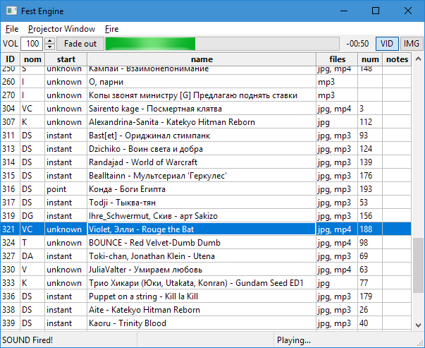

Сидел я однажды на региональном Аниме-фесте, смотрел как на проекторе мышкой таскают файлы и осознал что хватит это терпеть!

Миру нужна система, через которую можно одновременно показывать картинку на втором мониторе (задник), включать аудио и при необходимости включать видео вместо картинки.

На одном компьютере.

В одном приложении.

Приехал домой и создал этот репозиторий. Давно хотел что-нибудь полезное назвать **FestEngine**

## Как было раньше у меня:

- AIMP для аудио на первом компе/операторе без проектора
- Cosplay2 Timer для обратного отсчета на втором компе, который на проекторе
- FastStone для задников на втором компе/операторе
- Картинка феста на рабочем столе, скрытая панель задач. Копия картинки феста в FastStone, чтобы включать ее не сворачивая FastStone
- VLC для видео хитро настроенный автоматически разворачиваться на втором мониторе (обязательно нужно его закрыть на втором мониторе чтобы он именно там в следующий раз открылся при открытии файла) 
- Файла из папки, чтобы добраться до которой надо убрать фокус с FastStone

Как это в других лучше не знать... Мало кто отключает системные звуки даже, а мышка бегающая по проектору и интерфейсы винды -- это в порядке вещей.

# Как это теперь:

## Как это работает?

- Вписываем регулярное выражение, которое распарсит Ваши имена файлов. У меня файлы называются как-то так 
  `217 DG. РозЭль, Irina_Loner - League of Legends(№174).mp3`. Два номера потому что [Cosplay2](http://cosplay2.ru).
- Указываем путь к папочке с задниками и к папочке с аудио/видео участников.
- Запускаем FestEngine
- Приходим на фест
- Указываем какой из мониторов -- проектор

    

- Выбираем нужную строчку, ждём объявления участника, топим **F1** -- Задник на проектор пошёл.
- Выходин участник, топим **F2** -- Звук пошёл. Если видео, то видео тоже пошло вместо задника.
- Повторяем пока есть участники.
- Профит, все любят ваш фест! Только не забудьте отслушать все материалы на предмет низкого битрейта и отсмотреть все видосы **именно на том компе который будет на фесте**. 

# На чём это зиждется?

- **Python 2** -- в коде разберётся даже моя бабушка
- **wxPython** -- мощнее чем tcl/tk и более лампово чем Qt (ну не люблю я Qt)
- **VLC Python bindings** -- оказывается можно показывать видео через VLC не запуская VLC

Соответственно: Linux, Windows и MacOS нативно поддерживаются сразу из коробки

# В планах:

- Нарисовать замену [Cosplay2 Timer](https://vk.com/cosplay2ru?w=wall-64774987_200)
- Поиск
- Если в поле коментов вписать какой-нибудь ID, он сдублируется в нужном месте. Это будет удобно если участника паренесли и надо не забыть об этом
- Раскрашивать строки (подсвечивать ВЫРВИГЛАЗНО КРОВАВО КРАСНЫМ ЧТОБ СМОТРЕТЬ БЫЛО НЕВОЗМОЖНО строки в которых не все файлы найдены)
- F3 для музычки на уход участника из отдельной папки.
- F4 для музычки интермедий из отдельной папки. И возможно окна.
- Запилить все настройки в GUI, организовать их хранение и автозагрузку.
- Сделать бранч на mplayer, VLC Python bindings всё-таки сыроват.

Если ты чувствуешь в себе силу что-нибудь из этого запилить, будешь няшкой...