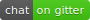
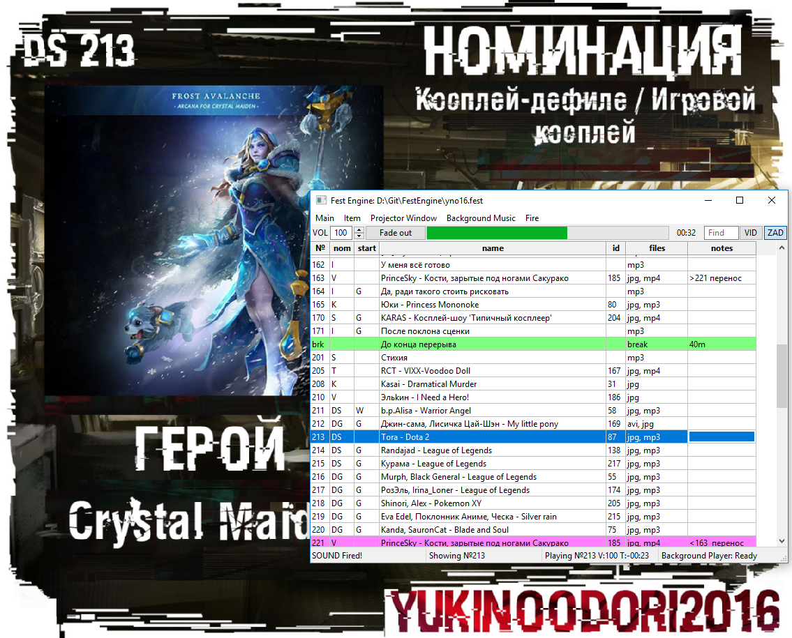

[](https://ci.appveyor.com/project/Himura2la/festengine)
[](https://travis-ci.org/Himura2la/FestEngine)
[](https://gitter.im/FestEngine/Lobby?utm_source=share-link&utm_medium=link&utm_campaign=share-link)

Сидел я однажды на региональном Аниме-фесте, смотрел как на проекторе мышкой таскают файлы и осознал что *хватит это терпеть!*

Миру нужна простая и бесплатная система, через которую можно одновременно показывать картинку на проекторе (задник), включать аудио и при необходимости включать видео вместо картинки.

На одном компьютере.

В одном приложении.

Приехал домой и начал писать **Fest Engine**. Давно хотел что-нибудь полезное назвать **Fest Engine**. Вроде норм звучит.

## Как было раньше:

- AIMP для аудио на первом компе/операторе без проектора.
- Cosplay2 Timer для обратного отсчета на втором компе, который на проекторе.
- FastStone для задников на втором компе/операторе.
- Нейтральная картинка на рабочем столе, скрытая панель задач. Копия этой картинки в FastStone, чтобы включать ее не сворачивая FastStone
- VLC для видео, хитро настроенный автоматически разворачиваться на втором мониторе (обязательно нужно его закрыть на втором мониторе, чтобы он именно там в следующий раз открылся при простом запуске файла из проводника).
- Чтобы добраться до которого, надо убрать фокус с FastStone и перейти в проводник.

Как это у других, лучше не знать... Мало кто отключает системные звуки даже, а мышка бегающая по экрану проектора и интерфейсы винды -- это в порядке вещей.

Ближайшие аналоги:

* [Show Cue System](https://www.showcuesystems.com/cms/)
* [Resolume Arena](https://resolume.com/)


# Как это теперь:




## Как это работает?

- Разворачиваемся по инструкии ниже или [качаем бинарик](https://github.com/Himura2la/FestEngine/releases).
- Запускаем [src/main.pyw](src/main.pyw) через [Python 3](https://www.python.org/downloads/) или `FestEngine.exe` (для минимальной версии бинарика, нужно сначала запустить [Install.bat](bin/Install.bat) от админа). Открываются пустые настройки.
- Натравливаем FestEngine на свои материалы и тестируем что всё работает. Проверяем что все файлы на месте и воспроизводятся, если нужно, перекодируем.
- Приходим на фест (с тем же ноутом).
- Указываем в настройках какой из мониторов -- проектор.
- Выбираем нужную строчку, ждём объявления участника, топим **F1** -- Задник на проектор пошёл.
- Участник готов выступать? Топим **F2** -- Звук пошёл. Если у него видео а не звук, всё работает само.
- Уходит участник -- жмём **Esc** чтобы убрать задник (и плавно увести его трек если тот не обрезан).
- Если на сцене длинная интермедия, ставьте подложку (фоновую музыку) нажатием **F3**. Можно использовать **F3** вместо **Esc**.
- Повторяем пока есть участники.
- Профит, все любят ваш фест! Только не забудьте отслушать все материалы на предмет низкого битрейта и отсмотреть все видосы **именно на том компе который будет на фесте**. 

### [Полный список шоткатов](https://github.com/Himura2la/FestEngine/issues/76)

# Как это настроить?

Пример настроек:


### [Пошаговая инструкция по применению](https://github.com/Himura2la/FestEngine/wiki)

# На чём это зиждется?

- **Python 3** -- Самый простой и удобный язык в мире
- **wxPython 4** -- Мощнее, чем tcl/tk. Нативнее, чем Qt.
- **VLC Python bindings** -- оказывается, можно показывать видео через VLC, не запуская VLC

Соответственно: Linux, Windows и MacOS нативно поддерживаются сразу из коробки (самом деле нет, надо [получше потестить](https://github.com/Himura2la/FestEngine/issues/16), сейчас хорошо поддерживаются только венда и вроде как Debian-based линуксы, но у последних есть [проблемы, связанные со странностями Gtk](https://github.com/Himura2la/FestEngine/issues?q=is%3Aopen+is%3Aissue+label%3A%22linux+only%22))

## Предупреждение для разработчиков

Код FestEngine выглядит дико и совсем не энтерпрайзно, но отказ от сложной модульной архитектуры был осознанным выбором. Главным принципом при разработке на данный момент является минималистичность: минимализация кодовой базы, времени разработки и фанатичное избегание всяческого вспомогательного кода. Всё сделано на 100% в лоб самым прямым и тупым методом. Это привело к тому что большенство кода находится в основном классе `MainWindow` и совершенно никак не тестируется, поскольку код плотно завязан на UI. Да, это не есть хорошо. Считайте, что это спайк. Если у Вас есть время спроецировать этот спайк на нормальную архитектуру, будет просто замечательно, но у нас его, как видите, нету. Надо фесты делать, а не классы наследовать, да интерфейсы имплементить. It's opensource, what did you expect? Гляньте на [bCNC](https://github.com/vlachoudis/bCNC), у них тоже всё плохо ))) я хотя бы по PEP8 пишу.

# Какие ещё киллер-фичи?

- [#4](https://github.com/Himura2la/FestEngine/issues/4): Если в поле комента вписать какой-нибудь ID (например `">183 maybe"`), строчка сдублируется в нужном месте. Это удобно если участника паренесли и надо не забыть об этом. Такие строки можно удалять и обновлять комент в них изменяя комент в исходной.
- [#2](https://github.com/Himura2la/FestEngine/issues/2): Офигительный поиск. Самый минималистичный, быстрый и удобный из возможных. Есть только одно текстовое поле -- туда можно вводить что угодно, по мере ввода таблица фильтруется. Выбираем что нужно в отфильтрованной, кликаем правой кнопкой по полю поиска и переходим в полную таблицу! Чтобы не забыть выйти из фильтра, фон отфильтрованной таблицы меняет цвет.  
- [#7](https://github.com/Himura2la/FestEngine/issues/7): Фоновая музыка на интермедии и удобный плеер к ней. Можно запускать и паузить одной кнопкой, а можно открыть полноценный плеер. В плеере можно включать конкретную композицию, смотреть какие отыграли а какие были скипануты, можно переходить к нужному времени в треке, есть Fade In/Out, [в планах Crossfade](https://github.com/Himura2la/FestEngine/issues/28).
- [#29](https://github.com/Himura2la/FestEngine/issues/29): Можно сделать резервный трек без видео для тех у кого видео.
- [#26](https://github.com/Himura2la/FestEngine/issues/26): Можно заменить трек или задник участника, особенно полезно для тех кто заменяет трек на репетиции. Но не забудьте заменить трек во всех резервных копиях или следить за тем [откуда воспроизвоядся файлы](https://github.com/Himura2la/FestEngine/issues/34)
- [#5](https://github.com/Himura2la/FestEngine/issues/5): Аналог Cosplay2-Timer. Можно вывенсти на проектор обратный отсчет до начала фестиваля или до конца перерыва. С этой штукой задержать начало намного сложнее \^\_\^
- [#41](https://github.com/Himura2la/FestEngine/issues/41) (beta): Текстовое окно, которое поможет световику ставить свет на ленту и позволяет узнать полную информацию о каждой заявке прямо в Fest Engine. Работает через SQLite базу данных из Cosplay2.

# [В планах](https://github.com/Himura2la/FestEngine/issues)

Если ты чувствуешь в себе силу что-нибудь из этого запилить, будешь няшкой и сделаешь звук на фестах чуть лучше!


# Как развернуть среду для разработки?

## Windows

- Выбрать разрядность (x32 или x64) и придерживаться этой разрядности во всех дальнейших установках
- Установить последний [Python 3](https://www.python.org/downloads/windows/) выбранной разядности. При установке отметить чекбокс **Добавить python.exe в PATH** (если это единственный Python, который у вас будет).
- Открыть консоль или PowerShell от администратора и установить [wxPython](https://wxpython.org/) (для графического интерфейса) и [VLC Python Bindings](https://wiki.videolan.org/python_bindings) (для управления плеером VLC)
   ```ps
   pip install --upgrade setuptools pip
   pip install wxpython python-vlc
   ```
- Установить последний [VLC](http://download.videolan.org/pub/videolan/vlc/) **выбранной разядности** (если у вас ничего не запускается, проверьте разрядность VLC. Это common issue).
- Установить [Git](https://git-scm.com/), [Fork](https://git-fork.com/), [GitKraken](https://www.gitkraken.com/), [SourceTree](https://www.sourcetreeapp.com/) или [GitHub](https://desktop.github.com/) и cклонировать репозиторий: `git clone https://github.com/Himura2la/FestEngine.git`
- (не обязательно) Скомпилировать локализацию путём запуска [msgfmt.bat](src/locale/msgfmt.bat)
- Запустить Fest Engine: из папки **src** выполнить `py main.pyw`
- Качнуть [тестовые данные](https://yadi.sk/d/fIT8QD_A3SGp8M) и запустить Fest Engine с данными.
- Писать код в [PyCharm](https://www.jetbrains.com/pycharm/) или [Visual Studio Code](https://code.visualstudio.com/) и отправлять Pull-Request'ы.
- Писать в [Gitter](https://gitter.im/FestEngine/Lobby?utm_source=share-link&utm_medium=link&utm_campaign=share-link), по поводу и без ))

## Debian-based

**Внимание!** `wxPython` при установке из `pip` обожает начинать компилироваться из исходников. Это безнадежное занятие, ему надо явно указать `.whl` наиболее подходящий для вашей системы (желательно, конечно, совсем подходящий, но вроде бы билды для чужих систем иногда работает). [Официальная инструкция](https://wxpython.org/pages/downloads/index.html), вам нужен раздел -- **Yes, we have Linux Wheels. Sort of.**

```sh
sudo apt install git python3 vlc -y
sudo -H pip3 install --upgrade setuptools pip
sudo -H pip3 install python-vlc
sudo -H pip3 install -f https://extras.wxpython.org/wxPython4/extras/linux/gtk3/ubuntu-16.04 wxPython
git clone https://github.com/Himura2la/FestEngine.git
cd FestEngine/src/locale && ./msgfmt.sh && cd ..
python3 main.pyw
```

# Кто это использует?

[С помощью Fest Engine проводились следующие мероприятия](USES.md)

# Как это дебажить?

Если не запускается на винде, возможно поможет использование версии с правильной разрядностью, или установка [Visual C++ Redistributable for Visual Studio 2015](https://www.microsoft.com/ru-ru/download/details.aspx?id=48145). При использовании минимальной версии, у вас должен быть установлен VLC той же разрядности, что и ваша система. Но вам еще [Install.bat](bin/Install.bat) про это расскажет ))

Если не запускается на линуксе, попробуйте запустить приложение до и после исполнения [install.sh](bin/install.sh). Еще можно установить/переустанвоить `vlc`. Больше мы ни с какаими проблемами не сталкивались, должно работать, пишите в [Gitter](https://gitter.im/FestEngine/Lobby?utm_source=share-link&utm_medium=link&utm_campaign=share-link) или [пишите баги](https://github.com/Himura2la/FestEngine/issues).

Если появляется окно с ошибками от wxPython, смело [пишите баги](https://github.com/Himura2la/FestEngine/issues) с содержанием ошибок, это значит что вы или ваша система делаете что-то, на что мы не рассчитывали ))
